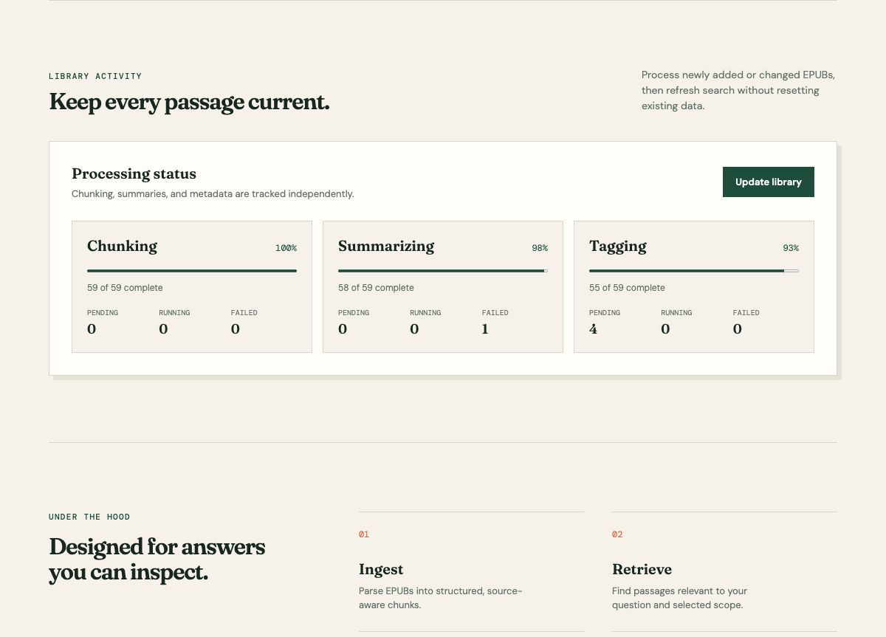

# Librarian

Librarian is a local-first personal library assistant for EPUB collections. It
is meant to ingest books, build a searchable local knowledge base, and answer
questions with citations back to the source text.

The project is also an AI engineering learning ground. It is intentionally
designed around the parts of applied AI that matter in production systems:
ingestion, metadata modeling, chunking, embeddings, retrieval, reranking,
prompt assembly, source attribution, evaluation, and containerized local
infrastructure.

## Product tour


*Search across the whole library or narrow retrieval to a searchable author or
book scope.*


*Browse the local 59-book collection with title, author, and ingestion details.*



*Track ingestion and chunking, summarization, and metadata tagging from the
activity view.*

## Goals

- Ingest EPUB files from a configurable local folder.
- Extract useful book, author, chapter, and document structure metadata.
- Chunk books in a way that preserves source context.
- Generate embeddings locally without OpenAI API keys.
- Store source text, metadata, and vectors on this machine.
- Support semantic, keyword, and eventually hybrid retrieval.
- Answer questions across one book, one author, or the whole library.
- Cite the source passages used to produce each answer.
- Keep startup simple with Docker Compose and local volumes.

## Example Questions

Librarian should eventually support questions like:

- "I want to read a book that teaches me about distributed systems."
- "I want a fantasy book with political intrigue and strong worldbuilding."
- "What does this author say about suffering?"
- "Compare how these three books talk about habit formation."
- "Is this book worth reading for learning AI engineering?"
- "Find books in my library that discuss retrieval-augmented generation."

## Local-First Model

The project is designed to avoid OpenAI API-key billing for large book
processing jobs. Full-book ingestion should not call a hosted chat model.
Instead, ingestion is deterministic and local:

1. Parse EPUB files.
2. Clean and normalize text.
3. Split text into source-aware chunks.
4. Generate local embeddings.
5. Store chunks, metadata, and vectors locally.

For answer generation, Librarian can optionally call a host-side Codex broker
after retrieval. That means only the user's question and a small set of relevant
passages are sent to Codex CLI for synthesis. Codex uses the existing Codex
login rather than an OpenAI API key.

Codex is not used as the embedding system. Embeddings require stable numeric
vectors, so they should come from a local embedding model such as
`nomic-embed-text`, `bge-small-en`, `all-MiniLM-L6-v2`, or a similar small
model that can run comfortably on local hardware.

## Architecture

```text
configured EPUB folder
  -> ingestion worker
  -> EPUB parser
  -> text cleaner
  -> structure-aware chunker
  -> local embedding model
  -> local metadata/vector store
  -> retrieval service
  -> optional Codex broker for answer synthesis
  -> web/API clients
```

## Major Components

### EPUB Ingestion

The ingestion layer reads EPUB files from the configured books directory,
extracts metadata, and turns book content into normalized text. EPUB files can
have messy metadata and inconsistent internal structure, so this layer should be
defensive and keep the original file hash for idempotent re-ingestion.

### Chunking

Chunking should preserve where text came from. A chunk should know its book,
author, chapter or section, order within the book, and nearby chunks. This makes
retrieval better and lets answers cite useful locations instead of anonymous
text blobs.

### Local Embeddings

Embedding generation should run locally. The first version can use a lightweight
model through a Python package or local model service. Embeddings are generated
for each chunk and for each query.

### Storage

The MVP should use the simplest local storage that works well. SQLite plus a
lightweight vector option is a good first target. Postgres with pgvector or
OpenSearch can come later once the ingestion and retrieval loop is proven.

### Retrieval

Retrieval starts with semantic vector search. Later versions should add keyword
search and hybrid retrieval so exact terms, names, quotes, and technical phrases
work well alongside semantic queries.

### Generation

Generation happens after retrieval. The generator receives a compact prompt
containing the user question, retrieved passages, and citation metadata. The
answer should cite the passages it uses and clearly say when the retrieved
evidence is insufficient.

### Codex Broker

The broker is a small host-side service that wraps `codex exec`. Containers can
call the broker over HTTP instead of mounting Codex credentials into Docker. It
is optional and should be treated as an answer synthesis layer, not as core
storage or ingestion infrastructure.

## First Target

- Parse EPUBs from the configured books directory.
- Store book, author, chapter, and chunk metadata locally.
- Generate embeddings locally.
- Retrieve relevant chunks for a user query.
- Send only retrieved passages to a generator, with citations.

## Repository Layout

```text
apps/api/              FastAPI application surface
apps/codex_broker/     Host-side Codex CLI wrapper service
packages/              Local Python packages:
  librarian_config      Shared environment/default resolution
  librarian_storage     SQLite storage adapter and storage records
  librarian_ingestion   EPUB parsing, chunking, and ingestion workflow
  librarian_search      Query embedding, vector search, and hybrid retrieval
  librarian_chat        Grounded answer orchestration and generation providers
  librarian_recommendations
                        Book-level recommendation queries
  librarian_evaluation  Retrieval and answer-quality evaluation utilities
books/                 Optional local EPUB input folder, ignored by Git
Epub-Books/            Local test EPUB folder, ignored by Git
data/                  Local runtime data, ignored by Git
models/                Local model cache/config, ignored by Git
docs/                  Architecture notes
scripts/               Developer helper scripts
```

## Phase Plans

- [Phase 1: EPUB Ingestion MVP](docs/phase-1-ingestor.md)
- [API OpenAPI Contract](docs/api-endpoints.md)
- [Evaluation Strategy](docs/evaluation-strategy.md)

## Current Status

Librarian has completed Phase 6: Hybrid Retrieval. The core local RAG loop is
working end to end: EPUB ingestion, chunk storage, local embeddings through
Ollama, SQLite-backed vector search, OpenSearch-backed hybrid retrieval, a
FastAPI surface, a standalone chat CLI, and book-level recommendation queries.

The repo now has deterministic retrieval and answer-quality smoke reports for
CI, optional live reports that run the golden corpus against an ingested local
SQLite database, scoped retrieval by book and author, on-demand chapter/book
summaries, topic tags, genre metadata, and recommendation-oriented book queries.

SQLite remains the source of truth for book records, raw text, summaries, tags,
genres, and job status. OpenSearch is the rebuildable query index for vector,
keyword/BM25, and filtered retrieval; its hybrid rank fusion improves exact
term, name, and phrase matches alongside semantic search. The responsive React
UI now supports library browsing, processing status, inspectable citations, and
whole-library, author, or book chat scopes. Operational polish is the next
planned phase.

## Roadmap

### Phase 0: Workspace Foundation

- Create the repository structure.
- Add Docker Compose.
- Add API and ingestion package skeletons.
- Add Codex broker skeleton.
- Document architecture and local-first constraints.

### Phase 1: EPUB Ingestion MVP

See the detailed implementation plan:
[Phase 1: EPUB Ingestion MVP](docs/phase-1-ingestor.md).

- Scan the configured books directory for EPUB files.
- Compute file hashes to skip unchanged books.
- Parse EPUB metadata and text.
- Store book and chunk records locally.
- Add ingestion status reporting.
- Add basic tests with small fixture EPUBs.

### Phase 2: Local Embeddings and Vector Search

- Choose the first local embedding backend.
- Generate embeddings for chunks.
- Store vectors locally.
- Add query embedding generation.
- Return top matching chunks for a query.
- Add a simple `/search` endpoint.

### Phase 3: Retrieval-Augmented Answers

- Build prompt assembly with citation metadata.
- Add `/chat` endpoint.
- Add a standalone chat CLI while the desktop frontend does not exist.
- Support local generation through Ollama.
- Require answers to cite retrieved passages.
- Add refusal behavior when evidence is weak.

### Phase 4: Evaluation and Quality Reports

See the evaluation north star:
[Evaluation Strategy](docs/evaluation-strategy.md).

- Add a golden evaluation dataset format.
- Add automatic retrieval evaluation metrics.
- Add answer-quality evaluation rubrics.
- Aggregate metrics into single run reports.
- Track latency, model/provider settings, and Git commit metadata.
- Use reports to compare chunkers, embedding models, retrieval strategies, and
  generation providers.

### Phase 5: Better Book Intelligence

- Add author-level and book-level filtering.
- Add chapter summaries generated on demand.
- Add topic tagging from stored book summaries.
- Add genre classification from stored book summaries.
- Add asynchronous chapter/book summary generation after ingestion.
- Add recommendation-oriented queries.
- Add saved searches or reading lists later as product polish.

### Phase 6: Hybrid Retrieval (Complete)

- [x] Add OpenSearch as a local search service.
- [x] Index chunks and book metadata into OpenSearch.
- [x] Add keyword/BM25 search.
- [x] Combine vector and lexical retrieval with weighted rank fusion.
- [x] Add hybrid reranking through normalized lexical and vector scores.
- [x] Improve exact phrase, name, and technical-term search.
- [x] Evaluate retrieval quality with a small benchmark set.

### Phase 7: User Interface (Complete)

- [x] Add a simple web UI.
- [x] Support library browsing.
- [x] Show ingestion progress.
- [x] Show citations and source passages.
- [x] Support scoped chat over one book, one author, or the whole library.

### Phase 8: Operational Polish

- [x] Add one-command startup.
- [x] Add database migrations.
- [ ] Add backup/export guidance.
- [ ] Add observability for ingestion and query latency.
- [ ] Add error handling for malformed EPUB files.
- [ ] Add configuration profiles for small-machine and heavier-machine setups.

### Immediate Next: Search Performance and Correctness Hardening

Before continuing the remaining Phase 8 operational polish, prioritize
[search performance (#73)](https://github.com/JonathanGWesterfield/Librarian/issues/73)
and [answer correctness (#74)](https://github.com/JonathanGWesterfield/Librarian/issues/74):

- [ ] Route chat retrieval through OpenSearch hybrid search instead of SQLite
  full-vector cosine scanning.
- [ ] Measure and separate retrieval latency from generation latency, then
  evaluate response streaming.
- [ ] Suppress publisher and front-matter noise in retrieved context.
- [ ] Improve result/source diversity and source attribution.
- [ ] Enforce corpus and claim boundaries, including refusal when the library
  cannot support an answer.
- [ ] Rerun live retrieval and correctness baselines after these changes.

## Design Principles

- Keep source text and metadata local.
- Do not use hosted LLM calls during full-book ingestion.
- Prefer deterministic processing before model calls.
- Use small, replaceable interfaces for embedding and generation providers.
- Preserve citations as first-class data.
- Start simple, then swap in heavier infrastructure only when needed.
- Treat retrieval quality as something to measure, not guess.

## Local Development

### Standard Docker Compose path

Install and start a Docker runtime with Docker Compose v2, then run the
launcher from the repository root:

```bash
scripts/start_local.sh
```

On Windows, run `./scripts/start_local.ps1`. The launcher creates the ignored
`config/librarian.json` file from the tracked example, resolves its non-secret
Compose values, and starts only the model services the configuration requires.
It builds the API image for the host architecture, starts OpenSearch, and, when
configured for Docker Ollama, pulls the configured embedding and generation
models before starting the API and production web UI. Model files live in the
named `ollama-models` Docker volume, so they survive container restarts.

The normal command builds and runs only the lean `runtime` image. It never
starts evaluation automatically; the test/evaluation harness is a separate
Docker target behind a one-shot `verify` profile.

No host Python, virtual environment, Homebrew, or native Ollama installation is
required for this normal app path. A virtual environment cannot change a host
Python version; the container image owns that runtime instead.

The command starts the stack in the background. To follow logs, use:

```bash
docker compose ps
docker compose logs --follow api web
```

Open the Web UI URL printed by the launcher (normally <http://localhost:3000>).
The API documentation is normally <http://localhost:8000/docs>. The optional
summary worker is intentionally separate because it can consume generation resources:

```bash
scripts/start_local.sh --with-workers
```

The Bash convenience helpers are available for macOS/Linux, or Windows through
WSL/Git Bash; they are not native Windows PowerShell or Command Prompt scripts:

```bash
scripts/bootstrap_local.sh
scripts/start_local.sh --with-workers
scripts/stop_local.sh
```

`bootstrap_local.sh` only checks the Compose configuration and delegates to
`start_local.sh`. It does not install host tooling. To validate the Compose file
without starting containers, run `scripts/setup_local.sh` (or directly run
`docker compose config`).

### JSON configuration and provider selection

All operational settings live in the ignored `config/librarian.json` file. The
launcher creates it from [`config/librarian.example.json`](config/librarian.example.json)
on first run. JSON is authoritative; `LIBRARIAN_*` shell variables are not read.

For the populated, non-secret Codex-compatible gateway baseline, copy
[`config/librarian.base.json`](config/librarian.base.json) and add its referenced
token file under ignored `config/secrets/`. See
[`docs/configuration.md`](docs/configuration.md) for the full configuration
reference, provider matrix, secret rules, and validation steps.

The `embedding` and `generation` sections are independent. Each accepts
`docker_ollama`, `native_ollama`, or `openai_compatible`; generation also accepts
`codex`. `generation.answer_capability` is an explicit product default:
`lightweight` for the Compose model and `quality` for a capable configured
provider. Gateway credentials belong in ignored files below `config/secrets/`,
referenced by `api_key_file` or `header_files`; they are never rendered into the
generated Compose override.

`headers` is only for non-secret request metadata, such as `User-Agent`,
`OpenAI-Organization`, or `OpenAI-Project`. Literal credential-bearing headers
(`Authorization`, API-key variants, tokens, and subscription keys) are rejected
there and must instead be referenced through `header_files` below
`config/secrets/`. This keeps every credential out of `librarian.json`.

The Compose database default is `sqlite:////data/librarian.db`, which is the
absolute path of its bind-mounted `data/` directory. Commands run from the host
repository continue to use `sqlite:///data/librarian.db`.

SQLite migrations run automatically during normal application startup; no
manual migration command is required. Successful migrations are recorded in
the database's `schema_migrations` table with their version, stable name, and
UTC application time. Existing library rows are upgraded in place and
preserved. **If startup reports a newer or unknown schema version, do not edit
the migration history or retry with older code: run an application version that
supports that database before making any further changes.**

OpenSearch defaults to a `-Xms192m -Xmx192m` JVM heap so the full local stack
fits in Docker Desktop's common 2 GB VM allocation. Change
`services.opensearch_java_opts` in JSON when Docker has more memory available.

`docker_ollama` uses the Compose hostname automatically. For native Ollama,
choose `native_ollama` and set `base_url` to
`http://host.docker.internal:11434` in the relevant provider section. For an
OpenAI-compatible gateway, choose `openai_compatible`, set its `base_url`, and
store its credentials beneath `config/secrets/`. The Compose file maps
`host.docker.internal` on Linux as well as Docker Desktop.

### Full Compose verification

The full verification path exercises the same runtime API image used above,
plus Compose Ollama and OpenSearch. Its short-lived `verifier` container uses
the separate `test` target, ingests only the committed rights-safe
`tests/fixtures/epubs/sample.epub`, rebuilds OpenSearch, and calls the runtime
API's `/search/hybrid` endpoint. It does not mount `Epub-Books/` or local
`data/`.

Verification needs at least 4 GB (decimal, 4,000,000,000 bytes) assigned to
Docker's VM. Check that first,
then run the isolated verifier:

```bash
scripts/run_compose_verification.sh
```

Use `VERIFY_MIN_MEMORY_GB=6 scripts/verify_preflight.sh` (or
`--minimum-gb 6`) for a higher threshold. If the check fails, increase Docker
Desktop memory in **Resources**, or restart Colima with a larger allocation
such as `colima start --memory 4`. This is Docker VM runtime memory, not the
on-disk image size. The runner creates an isolated `librarian-verify` Compose
project, starts the runtime dependencies with `--wait`, then explicitly runs
the profile-gated verifier; `ollama-init` cannot abort it. Its EXIT trap removes
only that project's fixture SQLite, OpenSearch, and Ollama model volumes. Set
`VERIFY_PROJECT` to choose a different isolated project name.

Stop the normal stack without deleting models or search data:

```bash
docker compose down
```

Deliberately deleting named volumes with `docker compose down --volumes` also
deletes downloaded Ollama models and OpenSearch data.

Runtime logs are written to stdout and to `paths.log_file` in JSON. With the
default Docker configuration, inspect live output
with `docker compose logs api` and the persisted file at `data/librarian.log`.

Run the test suite:

```bash
scripts/test.sh
```

Run checks used by pull requests:

```bash
scripts/check.sh
```

The test suite includes end-to-end coverage for both the CLI and FastAPI
flows. Those tests ingest the fixture EPUB, rebuild embeddings, search, and ask
a chat question against a temporary SQLite database with deterministic local
model fakes, so repo cleanup should break tests before it breaks the product
path.

Run EPUB ingestion into the local SQLite database:

```bash
python3 scripts/play/ingest_epubs.py --books-dir ./Epub-Books --database-url sqlite:///data/librarian.db
```

For a more inspectable step-by-step flow, use the playground CLI:

```bash
python3 scripts/play/librarian.py --database-url sqlite:///data/librarian.db state
python3 scripts/play/librarian.py --database-url sqlite:///data/librarian.db ingest --books-dir ./Epub-Books
python3 scripts/play/librarian.py --database-url sqlite:///data/librarian.db books
python3 scripts/play/librarian.py --database-url sqlite:///data/librarian.db chunks --limit 3
python3 scripts/play/librarian.py --database-url sqlite:///data/librarian.db embed --reset --embedding-provider ollama --embedding-model all-minilm
python3 scripts/play/librarian.py --database-url sqlite:///data/librarian.db embeddings --limit 3
python3 scripts/play/librarian.py --database-url sqlite:///data/librarian.db search "How brutal and terrible is war?" --embedding-provider ollama --embedding-model all-minilm --limit 10
python3 scripts/play/librarian.py --database-url sqlite:///data/librarian.db state
```

After embeddings exist, rebuild the OpenSearch index and try hybrid retrieval:

```bash
python3 scripts/index_opensearch.py \
  --database-url sqlite:///data/librarian.db \
  --opensearch-url http://localhost:9200 \
  --index-name librarian-chunks \
  --embedding-provider ollama \
  --embedding-model all-minilm \
  --reset

python3 scripts/play/librarian.py \
  hybrid-search "psychohistory and empire" \
  --opensearch-url http://localhost:9200 \
  --index-name librarian-chunks \
  --embedding-provider ollama \
  --embedding-model all-minilm \
  --genre "Science Fiction" \
  --limit 10
```

Scripts under `scripts/play/` are development/operator tools. They are useful
for understanding the pipeline, but the product path should call FastAPI
endpoints or package services directly.

The `ingest` step parses EPUB files and stores chunked raw text. The `embed`
step reads those stored chunks and writes vectors into `chunk_embeddings`
without deleting `books`, `chunks`, or raw text.

### Stage-Specific Ollama Models

Embedding and summarization are configured separately. This is important on
small local machines because embedding models are usually tiny, while summary
generation models can easily exceed available RAM and make the worker look
stalled.

Use the `embedding` section of `config/librarian.json` for chunk/query vectors:

```json
"embedding": {"mode": "docker_ollama", "model": "all-minilm"}
```

Use the `generation` section for chat, summarization, tags, genres, and
recommendation text:

```json
"generation": {
  "mode": "docker_ollama",
  "model": "qwen2.5:1.5b",
  "answer_capability": "lightweight"
}
```

When ingesting books, summary jobs can be queued with a model that is different
from the embedding model:

```bash
python3 scripts/play/ingest_epubs.py \
  --books-dir ./Epub-Books \
  --database-url sqlite:///data/librarian.db \
  --embed \
  --embedding-provider ollama \
  --embedding-model all-minilm \
  --enqueue-summaries \
  --summary-generation-provider ollama \
  --summary-generation-model qwen2.5:1.5b
```

The selected summary provider/model/detail are stored on each queued summary
job, so changing the configured generation model later only affects newly queued
jobs or explicit rebuild/reset operations.

For grounded answer synthesis, use the standalone chat CLI:

```bash
python3 scripts/chat.py \
  --database-url sqlite:///data/librarian.db \
  --embedding-provider ollama \
  --embedding-model all-minilm \
  --generation-provider ollama \
  --generation-model qwen2.5:1.5b \
  --answer-capability lightweight \
  --retrieval-limit 30 \
  "How brutal and terrible is war?"
```

For on-demand book summarization, use the standalone summary CLI. This example
targets the current test book for human review:

```bash
python3 scripts/summarize.py \
  --database-url sqlite:///data/librarian.db \
  book \
  --book-title "Forward the Foundation" \
  --author "Isaac Asimov" \
  --generation-provider codex \
  --generation-model codex \
  --detail medium \
  --max-section-chars 12000
```

If your terminal cannot find the bundled Codex executable, set
`codex_executable` in `config/librarian.json` to the full path returned by
`which codex` in an environment where Codex is available.

To rebuild summaries for a different provider/model, either reset during the
summary run:

```bash
python3 scripts/summarize.py \
  --database-url sqlite:///data/librarian.db \
  book \
  --book-title "Forward the Foundation" \
  --author "Isaac Asimov" \
  --generation-provider ollama \
  --generation-model qwen2.5:1.5b \
  --detail medium \
  --reset
```

Or delete cached summaries directly:

```bash
python3 scripts/summarize.py \
  --database-url sqlite:///data/librarian.db \
  delete \
  --book-title "Forward the Foundation" \
  --author "Isaac Asimov" \
  --generation-provider codex \
  --generation-model codex \
  --detail medium
```

To process summary jobs queued during ingestion, run the worker. One batch:

```bash
python3 scripts/process_summary_jobs.py \
  --database-url sqlite:///data/librarian.db \
  --limit 1
```

Or poll continuously until stopped:

```bash
python3 scripts/process_summary_jobs.py \
  --database-url sqlite:///data/librarian.db \
  --watch \
  --poll-interval-seconds 10
```

In Docker, the summary worker is opt-in so it does not unexpectedly spend LLM
time during every local startup:

```bash
docker compose --profile workers up --build
```

For automation or a future desktop shell, request JSON output:

```bash
python3 scripts/play/ingest_epubs.py --books-dir ./Epub-Books --database-url sqlite:///data/librarian.db --json
```

The API also exposes ingestion-oriented endpoints that a future Electron or
Tauri frontend can call:

```text
POST /ingestion/run        body: books_dir, database_url, force, list_epubs,
                            embed_chunks, embedding_provider, embedding_model,
                            ollama_base_url, embedding_batch_size,
                            enqueue_summaries, summary_generation_provider,
                            summary_generation_model, summary_detail
POST /embeddings/rebuild   body: database_url, embedding_provider,
                            embedding_model, ollama_base_url, reset, reset_all
POST /embeddings/query     body: query, embedding_provider, embedding_model,
                            ollama_base_url
POST /search               body: query, database_url, embedding_provider,
                            embedding_model, ollama_base_url, limit,
                            book_id, book_title, author, include_non_content
POST /search/hybrid        body: query, opensearch_url, index_name,
                            embedding_provider, embedding_model,
                            ollama_base_url, limit, book_id, book_title, author,
                            include_non_content, genre, tag
POST /chat                 body: question, database_url, embedding_provider,
                            embedding_model, generation_provider,
                            generation_model, answer_capability, ollama_base_url,
                            retrieval_limit, book_id, book_title, author,
                            include_non_content
POST /books/{book_id}/summary
                           body: database_url, generation_provider,
                            generation_model, ollama_base_url, detail,
                            chunks_per_section, max_section_chars,
                            force_refresh, reset, include_chapter_summaries
GET  /ingestion/summary    query: database_url
GET  /books                query: database_url, status, limit, offset
```

By default, Docker Compose mounts `./Epub-Books` into the API container at
`/books`. To use a different local folder, update `paths.host_books_dir` in
`config/librarian.json`:

```json
"paths": {"host_books_dir": "/absolute/path/to/epubs"}
```

Inside the container, the application reads `paths.books_dir`, which defaults
to `/books`. When running outside Docker, set that JSON field directly to the
local folder you want to ingest from.

## Codex Usage Boundary

Codex is treated as an optional generation layer, not as the embedding system.
Embeddings should come from a small local embedding model. Codex can be called
after retrieval, when the prompt contains only the user question and the top
passages needed for an answer.

The intended pattern is:

```text
large book processing -> local deterministic pipeline
embedding generation  -> local embedding model
retrieval             -> local database/index
final synthesis       -> optional Codex broker
```

Embedding models are runtime dependencies, not repository assets. The repo
tracks the provider, model name, and storage schema, but model weights should
live in Ollama's local model cache or another local model runtime.

Current default embedding configuration:

```json
"embedding": {"mode": "docker_ollama", "model": "all-minilm"}
```

For the default Compose path, the launcher waits for `ollama-init` to exit with
code zero, prints its diagnostics on failure or timeout, and verifies every
configured Docker Ollama model with `ollama list` before starting the API or
optional worker. See the local-development section above for the intentionally
manual native-Ollama override.

To rebuild embeddings without deleting raw book text or chunks:

```bash
python3 scripts/rebuild_embeddings.py --reset --embedding-provider ollama --embedding-model all-minilm
```

The matching API hook is:

```text
POST /embeddings/rebuild
```
