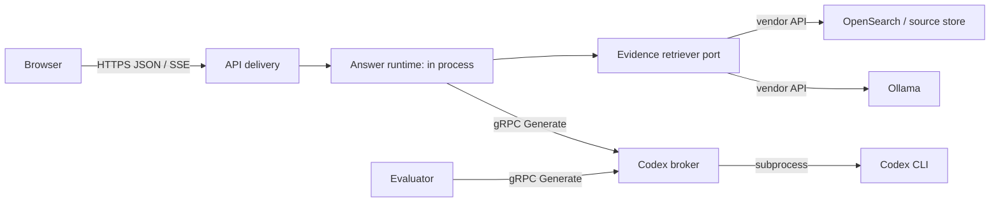

# Answer delivery technical design

**Status:** Approved M01 implementation baseline. Each focused implementation
slice must retain the contract and acceptance conditions in this document.

**Related:** [ADR 001](adr-internal-rpc-transport.md),
[compatibility plan](compatibility-and-migration.md),
[acceptance charter](acceptance.md), and
[roadmap](README.md).

## Goals and non-goals

The answer pipeline must have one evidence policy and one authoritative result,
whether the browser asks for buffered JSON or progressive SSE. Browser progress
may report state and candidate counts before validation; it must never reveal
unvalidated answer prose. Broad answers require ten relevant, distinct body-text
citations; bounded explanations require two; a point fact may use one. Weak
evidence produces a scoped refusal instead of an answer from model priors.

This design does not add public token streaming, replayable jobs, gRPC-Web,
WebSockets, a message bus, or a separately deployed answer runtime. It also does
not change OpenSearch, Ollama, or Codex's native adapters.

## Components and dependency direction



`librarian_answer` owns orchestration, evidence eligibility, citation
validation, repair budgeting, domain events, and result assembly. It depends on
four narrow ports: `EvidenceRetriever`, `GenerationBroker`, `SupportReviewer`,
and `RequestContext`. Adapters return contract types, never FastAPI responses,
ORM objects, search hits, or vendor message types. API delivery owns admission,
HTTP/SSE serialization, and browser disconnect detection. The broker owns
Codex subprocess management and generated gRPC service code.

The runtime remains in process through M08. M09 can deploy it only after a
reviewed decision establishes a scaling, isolation, ownership, or release need.
That future API-to-runtime boundary uses the specified `AnswerRuntime.Run`
stream and does not alter browser contracts.

## Complete boundary and migration inventory

`config/librarian.base.json` currently defaults `generation.mode` to
`docker_codex_broker`. Therefore every call through
`create_configured_generator()` is in scope; it is not safe to describe the
broker as chat-only. The following is the complete R0 source and entry-point
inventory, and is the M03 migration scope. No `Migrate R2` row may remain on
the legacy HTTP endpoint after its release.

| Current caller / entry point | R0 source path and work | R2 disposition, operation, and principal | Deadline / cancellation | Proof and retirement condition |
| --- | --- | --- | --- | --- |
| API chat (`/chat`, `/chat/stream`, later events) | `prepare_answer_question()` invokes grounded synthesis, semantic selection, and support/repair review | **Migrate R2:** `GROUNDED_SYNTHESIS`, `SEMANTIC_SOURCE_SELECTION`, `SUPPORT_REVIEW`; `api` principal | 30 s parent, 10 s selector, remaining parent budget for review; disconnect cancels | parity, timeout, repair/refusal, and live API Compose tests; delete HTTP generator path |
| API book summary (`POST /books/{id}/summary`) | `summarize_book()` generates chapter, reduction, and book summaries | **Migrate R2:** `CHAPTER_SUMMARIZATION`, `BOOK_SUMMARIZATION`; `api` principal | configured summary deadline capped by broker maximum; API cancellation cancels | chapter/reduce/book fixture and API Compose test; delete HTTP generator path |
| API tags (`POST /books/{id}/tags`) | `generate_book_tags()` calls the configured generator | **Migrate R2:** `TAG_GENERATION`; `api` principal | 30 s; request cancellation cancels | tag fixture and API Compose test; delete HTTP generator path |
| API genres (`POST /books/{id}/genres`) | `generate_book_genres()` calls the configured generator | **Migrate R2:** `GENRE_GENERATION`; `api` principal | 30 s; request cancellation cancels | genre fixture and API Compose test; delete HTTP generator path |
| API recommendations | `recommend_books()` generates a narrative for ranked candidates | **Migrate R2:** `RECOMMENDATION_SYNTHESIS`; `api` principal | 30 s; request cancellation cancels | recommendation fixture and API Compose test; delete HTTP generator path |
| `summary-worker` Compose profile | `scripts/process_summary_jobs.py` calls `summarize_book()` with configured generation | **Migrate R2:** `CHAPTER_SUMMARIZATION`, `BOOK_SUMMARIZATION`; `summary-worker` principal | job deadline is capped by the broker maximum; worker shutdown cancels | worker-profile Compose test with both operations; delete HTTP generator path |
| metadata worker profile added in R2 | `scripts/process_metadata_jobs.py` calls tag/genre generation | **Migrate R2:** `TAG_GENERATION`, `GENRE_GENERATION`; `metadata-worker` principal | 30 s per job; worker shutdown cancels | metadata-worker profile Compose test; delete HTTP generator path |
| evaluator Compose profile | `DockerCodexBrokerJudge` in `scripts/evaluate_retrieval.py` | **Migrate R2:** `EVALUATOR_JUDGEMENT`; `evaluator` principal | 30 s per judgement; evaluator cancellation cancels | evaluator Compose test, wrong-principal denial, and delete HTTP judge |
| Host CLI: `scripts/chat.py`, `scripts/summarize.py`, `scripts/process_summary_jobs.py`, `scripts/process_metadata_jobs.py`, `scripts/play/librarian.py`, and host `scripts/evaluate_retrieval.py` | Each can inherit the default configured generator or judge, yet the broker has no host port | **Guard before R2 and retain in R2:** Docker-broker mode requires a matching runtime role **and** the exact non-symlink Docker-secret file at `/run/secrets/codex-broker-<role>`; `LIBRARIAN_EXECUTION_PRINCIPAL` alone is never sufficient. Host CLIs must select Codex/Ollama/external provider or run the corresponding Compose profile. | fails before target/channel/HTTP-client construction | tests exercise every listed host entry point, including forged `LIBRARIAN_EXECUTION_PRINCIPAL=api` without a secret mount; error names the allowed profile/provider |
| Future extracted answer runtime | any answer operation after M09 only | deferred; `answer-runtime` principal and a dedicated private network | propagated absolute deadline and cancellation | required only if M09 is approved |

The API receives the `api` credential only, so it may serve all six API
operations but cannot impersonate a worker or evaluator. The operation matrix
below is allow-list based: an unknown operation, a known operation with the
wrong output contract, or a principal-operation mismatch is denied before any
Codex subprocess is admitted.

## v1 gRPC contract

The canonical source is `proto/librarian/answer/v1/answer_delivery.proto`, added
in M01. The source is owned by `packages/librarian_contracts`; generated Python
code is emitted under that package and checked in. The following appendix is
normative and can be copied verbatim as that initial file. It deliberately has
no imports: non-OK status detail is carried in standard `google.rpc.Status`
trailers, packing the locally declared `ErrorDetail` with the normal protobuf
`Any` type URL. M01 pins the `googleapis-common-protos`/`grpcio-status` versions
needed to encode and decode that standard trailer.

```proto
syntax = "proto3";
package librarian.answer.v1;

service GenerationBroker {
  // Authenticated startup compatibility check; it does not run Codex.
  rpc GetCapabilities(CapabilitiesRequest) returns (Capabilities);
  // The sole v1 provider-execution RPC.
  rpc Generate(GenerateRequest) returns (GenerateResult);
}

message CapabilitiesRequest {
  uint32 contract_major = 1;             // must be 1
  uint32 contract_minor = 2;             // must be in the server's inclusive range
  bytes descriptor_sha256 = 3;           // exactly 32 raw SHA-256 bytes
  string stack_release_sha = 4;          // exactly 40 lowercase hexadecimal Git SHA bytes
  reserved 5 to 15;
}
message Capabilities {
  uint32 contract_major = 1;
  uint32 min_contract_minor = 2;
  uint32 max_contract_minor = 3;
  bytes descriptor_sha256 = 4;           // exactly 32 bytes
  string stack_release_sha = 5;          // exactly 40 lowercase hexadecimal characters
  repeated GenerationOperation operations = 6;
  reserved 7 to 15;
}

enum GenerationOperation {
  GENERATION_OPERATION_UNSPECIFIED = 0;
  GROUNDED_SYNTHESIS = 1;
  SEMANTIC_SOURCE_SELECTION = 2;
  SUPPORT_REVIEW = 3;
  EVALUATOR_JUDGEMENT = 4;
  CHAPTER_SUMMARIZATION = 5;
  BOOK_SUMMARIZATION = 6;
  TAG_GENERATION = 7;
  GENRE_GENERATION = 8;
  RECOMMENDATION_SYNTHESIS = 9;
  reserved 10 to 15;
}
enum OutputContract {
  OUTPUT_CONTRACT_UNSPECIFIED = 0;
  GROUNDED_ANSWER_JSON_V1 = 1;
  SOURCE_SELECTION_JSON_V1 = 2;
  SUPPORT_REVIEW_JSON_V1 = 3;
  EVALUATOR_VERDICT_JSON_V1 = 4;
  PLAIN_TEXT_V1 = 5;
  TAGS_JSON_V1 = 6;
  GENRES_JSON_V1 = 7;
  reserved 8 to 15;
}
enum MessageRole { MESSAGE_ROLE_UNSPECIFIED = 0; SYSTEM = 1; USER = 2; ASSISTANT = 3; }
message ChatMessage {
  MessageRole role = 1;
  string content = 2;
  reserved 3 to 15;
}
message EvidenceCandidate {
  string candidate_id = 1;
  string book_id = 2;
  string chunk_id = 3;
  bytes source_sha256 = 4;               // exactly 32 bytes
  string scope_fingerprint = 5;
  bool body_text_eligible = 6;
  string retrieval_provenance = 7;
  string excerpt = 8;
  string source_revision = 9;            // ASCII 1..128 stable source-store revision
  reserved 10 to 15;
}
message EvidenceSnapshot {
  repeated EvidenceCandidate candidates = 1;
  bytes snapshot_sha256 = 2;             // exactly 32 bytes
  reserved 3 to 15;
}
message GenerateRequest {
  string request_id = 1;                 // canonical UUID
  string correlation_id = 2;             // ASCII 1..128 characters
  GenerationOperation operation = 3;
  string model_id = 4;                   // 1..256 UTF-8 bytes
  repeated ChatMessage messages = 5;
  OutputContract output_contract = 6;
  EvidenceSnapshot evidence_snapshot = 7; // omitted only where matrix permits
  reserved 8 to 15;
}
message GenerationSuccess { string content = 1; reserved 2 to 15; }
enum OutputViolation { OUTPUT_VIOLATION_UNSPECIFIED = 0; MALFORMED = 1; TOO_LARGE = 2; }
message InvalidStructuredOutput { OutputViolation violation = 1; reserved 2 to 15; }
message GenerateResult {
  string request_id = 1;
  string provider_model_id = 2;
  uint64 queue_wait_ms = 3;
  uint64 execution_ms = 4;
  oneof outcome {
    GenerationSuccess success = 5;
    InvalidStructuredOutput invalid_structured_output = 6;
  }
  reserved 7 to 15;
}
enum ErrorCode {
  ERROR_CODE_UNSPECIFIED = 0;
  REQUEST_LIMIT_EXCEEDED = 1; UNKNOWN_ENUM = 2; CONTRACT_MISMATCH = 3;
  CALLER_DENIED = 4; OPERATION_DENIED = 5; BROKER_NOT_READY = 6;
  ADMISSION_FULL = 7; EXECUTION_TIMEOUT = 8; EXECUTION_FAILED = 9;
}
message ErrorDetail {
  ErrorCode code = 1;
  bool retryable = 2;
  uint32 retry_after_ms = 3;
  string safe_message = 4;               // 1..256 bytes; never source/provider stderr
  string request_id = 5;
  reserved 6 to 15;
}
```

`Generate` is the only provider-execution operation; `GetCapabilities` is an
authenticated control-plane RPC and cannot admit a subprocess. The RPC receives
the bearer credential in `authorization`, the same 40-character release in
`x-librarian-stack-release`, and a generated request ID in
`x-librarian-request-id`. The body and metadata release must agree. The broker
derives the principal exclusively from the credential; a caller-supplied
principal header is ignored. These three metadata keys are the entire v1
metadata allow-list apart from gRPC's standard transport keys.

| Operation | Only accepted output contract | Evidence snapshot | Permitted principal(s) |
| --- | --- | --- | --- |
| `GROUNDED_SYNTHESIS` | `GROUNDED_ANSWER_JSON_V1` | required | `api`, future `answer-runtime` |
| `SEMANTIC_SOURCE_SELECTION` | `SOURCE_SELECTION_JSON_V1` | required | `api`, future `answer-runtime` |
| `SUPPORT_REVIEW` | `SUPPORT_REVIEW_JSON_V1` | required | `api`, future `answer-runtime` |
| `EVALUATOR_JUDGEMENT` | `EVALUATOR_VERDICT_JSON_V1` | forbidden | `evaluator` |
| `CHAPTER_SUMMARIZATION`, `BOOK_SUMMARIZATION` | `PLAIN_TEXT_V1` | forbidden | `api`, `summary-worker` |
| `TAG_GENERATION` | `TAGS_JSON_V1` | forbidden | `api`, `metadata-worker` |
| `GENRE_GENERATION` | `GENRES_JSON_V1` | forbidden | `api`, `metadata-worker` |
| `RECOMMENDATION_SYNTHESIS` | `PLAIN_TEXT_V1` | forbidden | `api` |

The gRPC deadline is authoritative; request payloads carry no timeout.
`request_id` is not an idempotency key: retrying an unknown outcome creates a
new ID and stays inside the caller's repair/job budget. A grounding refusal is
created by the answer runtime without calling the broker.

### Validation, size limits, and status mapping

The server validates before queue admission. It accepts at most 128 messages,
32 KiB UTF-8 per message, 192 KiB total messages, 32 evidence candidates, 8
KiB UTF-8 per excerpt, 256 KiB total snapshot, and 512 KiB serialized request.
`model_id`, `correlation_id`, and every string have the bounds in the proto
comments. A successful `GenerateResult` is at most 128 KiB serialized; generated
plain or structured content is at most 96 KiB UTF-8. Client and server configure
the same 512 KiB receive/send gRPC cap, so an oversized peer message cannot
bypass validation. The SSE projection has a separate 128 KiB event cap.

Unknown enum values, unspecified enums, malformed UUIDs/hashes, a mismatched
operation/output-contract pair, missing required evidence, and every size breach
return `INVALID_ARGUMENT` with `ErrorDetail.REQUEST_LIMIT_EXCEEDED` or
`UNKNOWN_ENUM`, are never queued, and are never retried automatically. A model
response which fits transport limits but violates a required JSON structure
returns **OK** with `invalid_structured_output`; that is a bounded domain result
which the runtime may repair once. All other non-OK calls carry exactly one
`ErrorDetail` in `grpc-status-details-bin` and no response body:

| gRPC status | `ErrorDetail.code` | Client action / public result |
| --- | --- | --- |
| `UNAUTHENTICATED` | `CALLER_DENIED` | fail pre-admission; operator change required |
| `PERMISSION_DENIED` | `CALLER_DENIED` or `OPERATION_DENIED` | fail pre-admission; never retry |
| `INVALID_ARGUMENT` | `REQUEST_LIMIT_EXCEEDED` or `UNKNOWN_ENUM` | caller defect; never retry |
| `FAILED_PRECONDITION` | `CONTRACT_MISMATCH` or `BROKER_NOT_READY` | keep API unready / refuse job admission; never fall back to HTTP |
| `RESOURCE_EXHAUSTED` | `ADMISSION_FULL` | safe unavailable outcome; retry only if `retryable` and caller budget remains |
| `DEADLINE_EXCEEDED` | `EXECUTION_TIMEOUT` | safe unavailable outcome; never publish a draft |
| `CANCELLED` | `EXECUTION_TIMEOUT` with `retryable=false` | terminal cancellation; no late completion |
| `UNAVAILABLE` | `BROKER_NOT_READY` | safe unavailable outcome; retry only after authenticated capability check succeeds |
| `INTERNAL` | `EXECUTION_FAILED` | safe unavailable outcome; sanitized diagnostic only in broker logs |

M01 reserves deleted field names and numbers, forbids proto `required`, and
computes `descriptor_sha256` from the checked-in canonical descriptor set. Fields
are additive only within the declared major. Unknown event kinds, unsupported
majors, and unsupported contract minors are rejected rather than guessed.

### Atomic compatibility handshake

Every R2 image is built from one clean, committed Git SHA. The release build
generates a checked-in-or-packaged, non-secret `librarian-stack-contract.json`
containing exactly: `stack_release_sha` (the 40-character Git SHA),
`contract_major`, `contract_minor`, and the raw-descriptor SHA-256 rendered as
lowercase hex. The broker, API, summary worker, metadata worker, and evaluator
read that same immutable manifest from their image; it is not user configuration
and cannot be overridden by an environment variable.

At process startup each generated client reads the manifest, opens its shared
channel, and calls authenticated `GetCapabilities` with all four request fields
and matching release metadata. The broker performs these checks in order:

1. authenticate the bearer and allow `GetCapabilities` for the derived
   principal;
2. require body/metadata `stack_release_sha` equality and exact equality to its
   immutable manifest;
3. require `contract_major == 1`, a requested minor inside its inclusive range,
   and exact descriptor digest equality; then
4. return its capabilities. Only after this response may the client mark itself
   ready or invoke `Generate`.

Any release or descriptor disagreement returns `FAILED_PRECONDITION` with
`ErrorDetail.CONTRACT_MISMATCH`, `retryable=false`, and no generation result.
The broker checks the same release metadata on **every** `Generate`, so an old
API/evaluator cannot become ready by racing startup and cannot use a newer
broker after it started. API `/health` and browser admission report unready
until their own authenticated check succeeds. Workers and evaluator exit before
claiming a job or starting an evaluation if it fails. Standard gRPC Health
proves scheduling liveness; this authenticated capability RPC proves version
compatibility. It is intentionally separate from the one execution RPC.

The client independently validates the returned major, inclusive minor range,
descriptor digest, and release SHA against its immutable manifest before marking
itself ready. A response that omits an expected operation or reports any
different value is treated as `CONTRACT_MISMATCH`, even if the broker accepted
the request. This makes a faulty or compromised server response unable to turn a
client ready merely because the request passed server-side checks.

### Evidence snapshot

The runtime receives an immutable snapshot from retrieval before it requests
generation or review. Each candidate contains `candidate_id`, `book_id`,
`chunk_id`, a stable source-store `source_revision`, content SHA-256, immutable
effective scope, body-text eligibility, retrieval provenance, and a bounded
excerpt. The v1
maximum is 8 KiB UTF-8 per excerpt, 32 candidates, and 256 KiB total snapshot.
Before final citation validation, the runtime reloads the source-of-truth record
by `book_id` and `chunk_id` and requires both an exact `source_revision` string
match and an exact 32-byte content SHA-256 match. A mismatch of either value
discards the run as `source_changed`; citations never silently move to
replacement text.

Candidate excerpts are server-only by default. Public progress carries counts,
book titles, and candidate IDs. A later UX change may expose excerpts only with
a separately versioned schema, an explicit content policy, and size limits.

## Authoritative runtime lifecycle

The runtime has `run(request, context) -> async iterator[AnswerEvent]` in
process. It constructs exactly one `AnswerResult`. If M09 extracts it, the
equivalent contract is:

```proto
service AnswerRuntime {
  rpc Run(AnswerRequest) returns (stream AnswerEvent);
  rpc GetCapabilities(CapabilitiesRequest) returns (Capabilities);
}
```

Each `AnswerEvent` has `schema_version`, request ID, a strictly increasing
positive `sequence`, and a `oneof payload`. Valid payloads are `started`,
`evidence_candidates`, `generation_started`, `validation_started`,
`answer_validated`, `completed`, `failed`, and `cancelled`. `AnswerResult` is
embedded unchanged in both `answer_validated` and `completed`; `completed` is
the authoritative terminal event. `answer_validated` occurs only for an
accepted answer. A refusal, source change, or generation-unavailable result
uses `completed` without an earlier answer event.

| State | Allowed next state |
| --- | --- |
| `started` | `evidence_candidates`, `completed`, `failed`, `cancelled` |
| `evidence_candidates` | `generation_started`, `completed`, `failed`, `cancelled` |
| `generation_started` | `validation_started`, `completed`, `failed`, `cancelled` |
| `validation_started` | `generation_started` for a bounded repair, `answer_validated`, `completed`, `failed`, `cancelled` |
| `answer_validated` | `completed` only |
| `completed`, `failed`, `cancelled` | none |

An SSE adapter maps one event to one named event with the same JSON envelope.
`POST /chat` collects the same iterator; it never starts a second generation.
Events use `id: <request_id>:<sequence>`. There is no replay, transparent retry,
or `Last-Event-ID` promise in v1. A POST disconnect creates no duplicate work.

## Admission, execution, cancellation, and shutdown

The initial broker uses `grpc.aio`, one shared channel/stub per caller process,
and `asyncio.create_subprocess_exec(..., start_new_session=True)` for Codex.
The broker owns the resulting process group. On RPC cancellation, deadline, or
shutdown it stops queued work; for started work it sends `SIGTERM` to the group,
waits 3 seconds, then sends `SIGKILL` and awaits reaping. A late provider output
is discarded and cannot produce a terminal result after cancellation.

Initial limits are deliberately small and configuration-validated: one active
Codex process, four queued requests FIFO, one-second admission/queue deadline,
30-second outer answer deadline, provider work limited to the remaining outer
budget less a two-second validation reserve, 64 buffered event messages, and a
five-second shutdown drain. Eight seconds remains the warm completion target;
it is not a second hidden provider timeout. Changing these limits requires a
measurement-backed configuration decision.

Browser abort propagates to the API context, the runtime context, and the
broker RPC. A broker call that cannot be cancelled reports cancellation to the
caller, continues only until the bounded process cleanup finishes, and is
recorded as an operator metric. The process-level integration test in the
acceptance charter is required; fake generator cancellation alone is not proof.

## Security, observability, and deployment

ADR 001's credential and plaintext-Compose exception are binding. R2 replaces
the implicit default-network arrangement with this exact Compose topology:

| Network | `internal` | Attached services | Purpose |
| --- | --- | --- | --- |
| `application` | no | web, API, OpenSearch, Ollama, workers/evaluator only when their existing work requires it | existing non-broker product traffic |
| `broker-api` | yes | broker, API | API's broker calls only |
| `broker-summary-worker` | yes | broker, summary-worker | summary worker's broker calls only |
| `broker-metadata-worker` | yes | broker, metadata-worker | tag/genre worker's broker calls only |
| `broker-evaluator` | yes | broker, evaluator | evaluator's broker calls only |
| `broker-egress` | no | broker only | Codex CLI's required outbound connectivity; no Librarian caller joins |

The broker publishes no `ports` entry, is absent from `application`, and listens
only on its private network interfaces. Each client resolves the same broker
service name only on its assigned network. `broker-egress` is dedicated to the
broker because an `internal`-only broker could not make Codex's necessary
outbound connection. A future runtime receives `broker-answer-runtime`, another
`internal: true` two-service network; it does not join any existing broker
network.

R2 uses Docker Compose secrets, not `./config:/config:ro`, for credentials.
The configuration resolver is the only process allowed to read the user-owned
`config/librarian.json` and its host-relative secret-path settings. It writes one
sanitized, non-secret runtime file per service at
`.runtime/config/<service>/librarian.json`. That file contains model, target,
contract version, and logical credential role but no `api_key_file`, token,
secret directory, or path which can reach a different principal. Each service
bind-mounts exactly its one resolved file at `/config/librarian.json:ro`.

R2 **forbids** a recursive mount of `config/`, `config/secrets/`, or any
ancestor that exposes either path in broker, API, summary-worker,
metadata-worker, evaluator, or web containers. In particular,
`./config:/config:ro` is retired. The only permitted `/config` content in those
containers is the sanitized `librarian.json` file. Compose tests assert
`/config/secrets` is absent and that `/config` contains no other regular file.

For an external OpenAI-compatible provider, the resolver consumes the
user-supplied `api_key_file` only on the host, then assigns its value to a
separate, role-specific Compose secret and removes the setting from the runtime
JSON. The consumer reads its own explicitly named
`LIBRARIAN_GENERATION_CREDENTIAL_FILE` under `/run/secrets`; it never discovers
it by traversing `/config`. A Docker-broker runtime JSON rejects `api_key_file`
outright and accepts only the process-assigned broker credential below. Host
direct execution may retain its existing explicit `api_key_file` behavior for
external providers, but Docker-broker host execution is rejected by the guard.

| Secret source under ignored `config/secrets/` | Mounted read-only at | Services allowed to mount it | Principal and capability |
| --- | --- | --- | --- |
| `codex-broker-api` | `/run/secrets/codex-broker-api` | broker, API | `api`; six API operations in the inventory |
| `codex-broker-summary-worker` | `/run/secrets/codex-broker-summary-worker` | broker, summary-worker | `summary-worker`; two summary operations |
| `codex-broker-metadata-worker` | `/run/secrets/codex-broker-metadata-worker` | broker, metadata-worker | `metadata-worker`; tag and genre only |
| `codex-broker-evaluator` | `/run/secrets/codex-broker-evaluator` | broker, evaluator | `evaluator`; judgement only |
| `codex-broker-health` | `/run/secrets/codex-broker-health` | broker only | `compose-health`; authenticated Health/Capabilities only |

The broker alone mounts all five verifier values. Every caller mounts one token
and exposes it to its generated client as `LIBRARIAN_BROKER_CREDENTIAL_FILE`; it
must not be read through the shared configuration mount. The broker's gRPC
auth interceptor maps the exact bearer secret to one principal and checks both
the RPC and the operation allow-list before deserializing/queuing work. A health
check runs inside the broker container with the health secret; it is an
authenticated gRPC Health `Check`, not an HTTP `/health` route. `SERVING` means
the scheduler can admit bounded work and required verifier material is present;
it does not claim that Codex login or a remote model is available.

Before it constructs a target, channel, HTTP client, or provider subprocess, the
Docker-broker client guard requires all of the following: (1) the sanitized
runtime JSON's logical role, (2) `LIBRARIAN_EXECUTION_PRINCIPAL`, and (3) the
basename of `LIBRARIAN_BROKER_CREDENTIAL_FILE` agree; (4) that path is exactly
`/run/secrets/codex-broker-<role>`; and (5) it is a regular, non-symlink,
readable file. The role must be one of `api`, `summary-worker`,
`metadata-worker`, or `evaluator`. The environment variable only selects a
candidate role; it is not proof of container admission. A host process that
forges it has no Docker-secret mount and fails this guard before attempting DNS
or a broker connection. The broker's credential interceptor remains the final
authority for the token and operation.

The following Compose shape is normative; implementation may add existing
non-broker mounts and resource settings but may not widen a listed network or
secret mount:

```yaml
secrets:
  codex-broker-api: {file: ./config/secrets/codex-broker-api}
  codex-broker-summary-worker: {file: ./config/secrets/codex-broker-summary-worker}
  codex-broker-metadata-worker: {file: ./config/secrets/codex-broker-metadata-worker}
  codex-broker-evaluator: {file: ./config/secrets/codex-broker-evaluator}
  codex-broker-health: {file: ./config/secrets/codex-broker-health}
networks:
  application: {}
  broker-api: {internal: true}
  broker-summary-worker: {internal: true}
  broker-metadata-worker: {internal: true}
  broker-evaluator: {internal: true}
  broker-egress: {}
services:
  codex-broker:
    networks: [broker-api, broker-summary-worker, broker-metadata-worker, broker-evaluator, broker-egress]
    secrets: [codex-broker-api, codex-broker-summary-worker, codex-broker-metadata-worker, codex-broker-evaluator, codex-broker-health]
    volumes: [./.runtime/config/codex-broker/librarian.json:/config/librarian.json:ro]
    expose: ["50051"]
  api:
    networks: [application, broker-api]
    secrets: [{source: codex-broker-api, target: codex-broker-api, mode: 0400}]
    volumes: [./.runtime/config/api/librarian.json:/config/librarian.json:ro]
    environment: {LIBRARIAN_BROKER_CREDENTIAL_FILE: /run/secrets/codex-broker-api}
  summary-worker:
    networks: [application, broker-summary-worker]
    secrets: [{source: codex-broker-summary-worker, target: codex-broker-summary-worker, mode: 0400}]
    volumes: [./.runtime/config/summary-worker/librarian.json:/config/librarian.json:ro]
    environment: {LIBRARIAN_BROKER_CREDENTIAL_FILE: /run/secrets/codex-broker-summary-worker}
  metadata-worker:
    networks: [application, broker-metadata-worker]
    secrets: [{source: codex-broker-metadata-worker, target: codex-broker-metadata-worker, mode: 0400}]
    volumes: [./.runtime/config/metadata-worker/librarian.json:/config/librarian.json:ro]
    environment: {LIBRARIAN_BROKER_CREDENTIAL_FILE: /run/secrets/codex-broker-metadata-worker}
  evaluator:
    networks: [application, broker-evaluator]
    secrets: [{source: codex-broker-evaluator, target: codex-broker-evaluator, mode: 0400}]
    volumes: [./.runtime/config/evaluator/librarian.json:/config/librarian.json:ro]
    environment: {LIBRARIAN_BROKER_CREDENTIAL_FILE: /run/secrets/codex-broker-evaluator}
```

The broker health command reads its own
`/run/secrets/codex-broker-health`; no client mounts it. `expose` documents the
container port but does not publish it to the host. The full R2 Compose file
must use long-form secret syntax for the broker as well if its runtime requires
explicit modes; the abbreviated entries above intentionally name every source
and target.

Compose tests must prove each negative property with an actual container: API
cannot read `/run/secrets/codex-broker-evaluator`; evaluator cannot read the API
secret or invoke an API operation; summary and metadata workers cannot invoke
each other's operation; and neither an unauthenticated container nor a service
on `application` can reach a broker private network. The only permitted secret
rotation is a planned atomic Compose replacement: write new role-specific files,
recreate broker and the affected caller(s) from one release manifest, verify
capabilities and health, then delete the old files. Multi-host or host-published
broker deployment is forbidden until a new ADR chooses TLS, mutual service
authentication, issuance, rotation, and revocation.

Every run records request ID, caller principal, operation, queue wait, channel
connection time, broker execution time, provider time where observable,
validation and repair time, terminal outcome, gRPC status, cancellation reason,
model ID, release SHA, descriptor hash, and delivery mode. It never records
prompt text, source text, credentials, or raw authorization metadata. Metrics
distinguish unavailable provider internals from measured values.

## Toolchain and ownership

M01 adds `packages/librarian_contracts`, `proto/`, and a repository-owned
`scripts/generate_contracts.sh`. The script invokes the exact project-pinned
`grpcio-tools`/`protobuf` versions in the project development environment to
generate Python `pb2` and `pb2_grpc` sources. The initial pins are
`grpcio-tools==1.80.0` and `protobuf==6.33.6`; the script rejects another
generator version. `grpcio` and `grpcio-health-checking` are exact runtime
dependencies of the broker and its clients. The generated sources are
committed so package builds do not require a compiler.

The browser is not generated from gRPC. M01 adds a separate versioned JSON
Schema for its event projection, committed fixtures, and a pinned TypeScript
generation command. CI runs the protobuf and TypeScript generators, fails if
their output differs, compiles the contracts, runs a protobuf breaking-change
check against the prior released schema, and verifies that no prohibited
`http://codex-broker` target exists outside a documented, temporary amendment.

M01 acceptance is a clean checkout command that runs the generators and all
contract fixtures without local EPUBs, secrets, Docker credentials, or a model.
